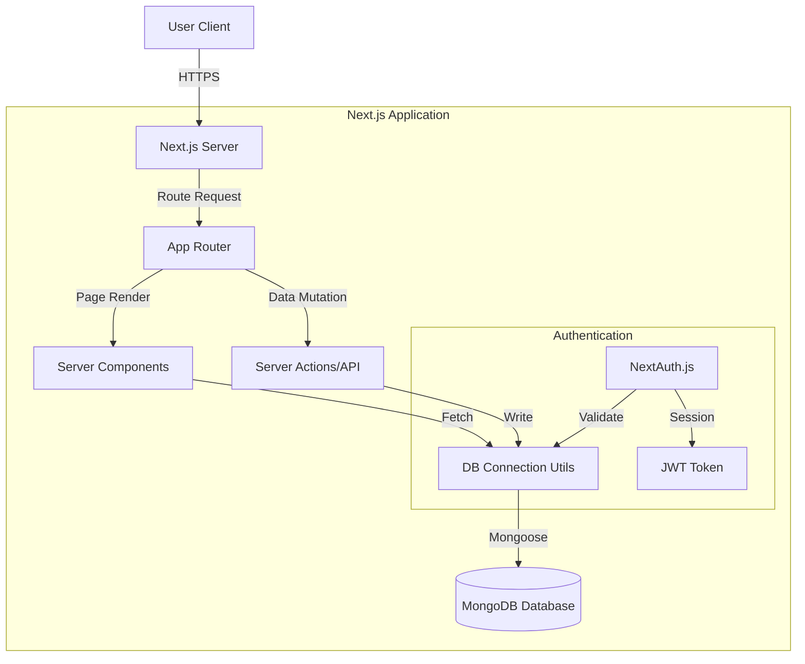

# System Architecture

## Overview

NutriGenie is a monolithic web application utilizing the **Next.js App Router**. It combines server-side rendering (SSR) for performance and SEO with client-side interactivity where needed.

## High-Level Architecture

## Data Flow

1.  **Authentication**:
    -   Users authenticate via **NextAuth.js**.
    -   Credentials or OAuth providers are verified.
    -   A JWT is issued and stored in an HTTP-only cookie.
    -   Middleware validates this token on protected routes.

2.  **Data Fetching**:
    -   **Server Components** fetch data directly from the database using Mongoose models.
    -   This bypasses the need for an internal API layer for GET requests, improving performance.

3.  **Data Mutation**:
    -   **Server Actions** (Planned) handle form submissions and mutations.
    -   Input data is validated securely on the server using **Zod**.

## Component Strategy

-   **Server Components**: Default. Used for layout, data fetching, and static content.
-   **Client Components**: explicitly marked with `"use client"`. Used for interactive elements (forms, buttons, charts) and accessing React Context (Session, Theme).

## Database Schema

-   **User**: Stores profile, preferences (dietary, cuisine), and auth strategy.
-   **MealPlan**: (Planned) Stores generated meal plans linked to a User.

## Security

-   **Environment Variables**: Sensitive keys (DB URI, Secrets) are stored in `.env.local` and never exposed to the client.
-   **Middleware Protection**: `middleware.ts` enforces authentication on `/dashboard` and other private routes.
-   **Input Validation**: All user inputs are validated with Zod before processing.
